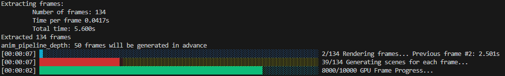

<!-- omit in toc -->
# Project Final Report

Final project report for ECE1724 - Performant Software Systems with Rust

Team members: Jackson Nie (1005282409) Jun Ho Sung (1004793262)

<!-- omit in toc -->
## Table of Contents
- [Motivation](#motivation)
  - [Performance Testing](#performance-testing)
- [Objectives](#objectives)
  - [Performance Optimization on GPU](#performance-optimization-on-gpu)
  - [Animation System Integration](#animation-system-integration)
- [Video Demo](#video-demo)
- [Features](#features)
  - [Pre-existing Features](#pre-existing-features)
  - [Project Features](#project-features)
    - [1. GPU Acceleration Implementation](#1-gpu-acceleration-implementation)
      - [Core Architecture](#core-architecture)
      - [Data Structure Adaptation](#data-structure-adaptation)
      - [Compute Pipeline Implementation](#compute-pipeline-implementation)
      - [Batch Processing System](#batch-processing-system)
      - [WGSL Shader Development](#wgsl-shader-development)
    - [2. Frame-by-frame animation rendering and mp4 formatting](#2-frame-by-frame-animation-rendering-and-mp4-formatting)
      - [Animation rendering pipeline](#animation-rendering-pipeline)
      - [Future improvements - Point the camera](#future-improvements---point-the-camera)
    - [3. Rendering information delivery improvements](#3-rendering-information-delivery-improvements)
- [How To Use (Reproducibility)](#how-to-use-reproducibility)
  - [Supported Schemes](#supported-schemes)
  - [Scheme Configuration File Manual](#scheme-configuration-file-manual)
- [Contributions](#contributions)
  

## Motivation
Our project combines our passion for gaming and computer graphics with an opportunity to enhance an existing ray tracer. Ray tracing technology, which creates photorealistic images by simulating light-object interactions, is increasingly crucial in modern graphics applications. While the current implementation delivers high-quality output through multithreading and KD-tree acceleration, performance and a lack of features remain key challenges.

This motivated us to propose an endeavour to accelerate the ray-tracing process leveraging modern GPUs. Both team members have experience in GPU programming with C++, but neither has experience implementing GPU solutions in Rust. This project, therefore, offers an ideal intersection of learning and practical application. As a language that promises "blazingly fast" performance while maintaining memory safety, Rust presents an excellent platform for high-performance computing tasks like ray tracing. By accelerating a computationally intensive graphics application, we will gain hands-on experience and learn the techniques of writing high-performance applications in Rust. This aligns perfectly with the course's goal of developing performant and scalable systems.

Beyond pure performance optimization, we aim to expand the ray tracer's capabilities by implementing new features such as short scene generation. These additions will make the project more engaging, and this combination of optimization and feature development will also provide additional challenges in maintaining performance at scale.

To summarize, through this project, we expect to:
* Significantly improve ray tracing performance through GPU acceleration
* Gain practical experience with Rust in high-performance computing
* Implement new features that showcase the intriguing capabilities of the ray tracer

### Performance Testing
We conducted rendering tests across two distinct scenes using varying parameters to establish baseline performance metrics and justify our optimization efforts. Tests were performed on Windows 11 and MacOS systems to evaluate cross-platform performance. These benchmarks will serve as comparison points for measuring improvements after our optimizations.

// TODO: add new tests. Walled, outside spheres, and maybe spaceship

Machine Specifications:
| Specification | Jun Ho's Machine | Jackson's Machine |
|--------------|------------------|-------------------|
| CPU | AMD Ryzen 5800x | Apple M1 Pro |
| GPU | AMD Radeon RX6800XT | Apple M1 Pro |
| RAM | 32GB 3200MHz | 16GB |
| OS | Windows 11 | Ventura 13.1 |

## Objectives
### Performance Optimization on GPU
* Port the existing CPU-based ray tracer to utilize GPU acceleration in Rust
* Implement parallel processing algorithms for various GPU architectures. Develop a flexible GPU backend that supports multiple architectures through generic GPU computation crates
* Conduct thorough performance analysis to:
    * Identify computational bottlenecks in the current implementation
    * Determine optimal GPU-accelerated algorithms for ray tracing operations
    * Since the bulk of the operations are simple math applied to a wide range of pixels, we believe that GPU acceleration fits this problem exceptionally well
* Based on the test results, target a minimum 5x speedup over current CPU implementation

### Animation System Integration
* Develop a kinematic-based animation system
* Implement efficient frame generation pipeline leveraging GPU-accelerated algorithms implemented previously


## Video Demo
<https://www.youtube.com/watch?v=YOUTUBE_VIDEO_ID_HERE>

## Features
### Pre-existing Features
* This project was forked from a pre-existing [rust ray-tracer](https://github.com/pmistry9597/Ray_Trace-Rust), that had the following existing features:
    * Multi-threaded CPU ray tracing
        * Traces rays in parallel by splitting work across CPU cores and gathering them at the end.
    * KD-tree optimization
        * Reduces the elements to test by splitting the scene into multiple sub-areas. The author mentioned that this yielded a ~60x speedup.

### Project Features
#### 1. GPU Acceleration Implementation
The project implements GPU-accelerated ray tracing using the [WGPU](https://github.com/gfx-rs/wgpu) framework, enabling high-performance parallel rendering across multiple GPU backends.

##### Core Architecture
The implementation utilizes WGPU's compute pipeline to execute ray tracing calculations in parallel on the GPU. Each pixel in the output scene is processed by a dedicated GPU thread, maximizing parallel computation efficiency.

##### Data Structure Adaptation
To enable GPU processing, extensive restructuring of CPU data structures was required:
* All CPU data structures were re-written and flattened to satisfy WGSL requirements
    * Mesh data was flattened into contiguous arrays of 32-bit floats (f32), with custom header structures to store offsets into the mesh buffer
* Memory layout was optimized for GPU access patterns and alignment requirements

##### Compute Pipeline Implementation
The compute pipeline was built using WGPU's API with several key components:

* Buffer binding system for GPU memory management
    * Buffers are binded to the compute pipeline once at the beginning of execution, and are reused across execution iterations

* Generic targeting to support multiple GPU backends
    * WGPU provides generic support for multiple different GPU backends

* Thread group allocation for pixel-parallel execution
    * Each GPU thread handles the tracing of 1 pixel of the output render target

* Pipeline state and shader resource management
    * All state and buffers are stored within the compute pipeline, and thus do not require multiple creations.

##### Batch Processing System
To prevent GPU timeout issues caused by extended processing times, a sophisticated batch processing system was implemented:

1. Workload is divided into manageable batches, toggleable by the user
2. Results are read back after each batch completion
3. Intermediate results are displayed to provide visual feedback
4. Compute pipeline is automatically resubmitted for the next batch
5. Progress tracking between batches

##### WGSL Shader Development
A custom WGSL shader was developed to perform the ray tracing computations:

* Flattened any recursive CPU algorithms to a non-recursive implementation
* Optimized ray-geometry intersection calculations to use native WGSL types and APIs
* GPU-specific memory access patterns by tracing headers and tracking offsets
* Support for all CPU-side features except KD tree traversal optimization
    * Flattening the KD-tree and traversing it sequencially proved to be more complicated than expected - this is the biggest future improvement feature
    * KD-tree buffers and GPU-side KD-tree traversal are implemented as of now. However, during the rendering phase, there is some kind of a bug, causing the final mesh render to be malformed.
----
#### 2. Frame-by-frame animation rendering and mp4 formatting
Taking advantage of the offloaded rendering compute leaving more CPU availability, the project utilizes the [keyframe](https://github.com/HannesMann/keyframe) crate to generate seamless frames concurrently with the GPU. Utilizing open-source video encoding frameworks allows this project to not require any third-party programs to be installed.

##### Animation rendering pipeline
1. Keyframes and desired frame rate are added by the user to the .yml configuration
2. Each frame is parsed, then added to the animation sequence
3. Based on the frame number, the animation sequence is advanced by the timeframe between each frame
4. If in the GPU rendering mode, the extrapolated frames are added to a queue, which the GPU concurrently consumes to generate each frame
5. After every frame is rendered, the [OpenH264](https://github.com/ralfbiedert/openh264-rs) crate is used to encode the video, then muxed out using the [minimp4](https://github.com/darkskygit/minimp4.rs) crate.

##### Future improvements - Point the camera
A camera "lookat" feature to point at and follow certain objects was explored. However, the transformation matrix generated resulted in incorrect rotations most of the time. Adding this feature is a great opportunity to achieve more exciting animations.

----
#### 3. Rendering information delivery improvements
Progress tracker bars have been added to better tell the progress of the run for static image rendering:
``` bash
PS E:\Rust Labs\project\Ray_Trace-Rust\target\release> .\ray_trace_rust ..\..\schemes\outside_spheres.yml

[00:00:06] ██████████████████████████████████████░░░░░░░░░░░░░░░░░░░░░░░░░░░░░░░░░░░░░░░░░░ 95000/200000 GPU Frame Progress...                 
```
And animation rendering: 
``` bash
PS E:\Rust Labs\project\Ray_Trace-Rust\target\release> .\ray_trace_rust ..\..\schemes\bounce_anim.yml
Extracting frames: 
         Number of frames: 134
         Time per frame 0.0417s
         Total time: 5.600s
Extracted 134 frames

[00:00:13] █░░░░░░░░░░░░░░░░░░░░░░░░░░░░░░░░░░░░░░░░░░░░░░░░░░░░░░░░░░░░░░░░░░░░░░░░░░░░░░░ 3/134 Rendering frames... Previous frame: 3.347s

[00:00:03] ██████████████████████████████████████████████████████████████████████████████░░ 9800/10000 GPU Frame Progress...
```


## How To Use (Reproducibility)
The program execution is as simple as running `cargo run --release <path_to_yml>`, while ensuring all the paths inside each `scene_members` are valid. If you're using the provided example schemes, the file paths are organized such that it works inside the `./target/release` directory.

The `--release` flag is required for maximum performance!
```bash
cargo build --release
cd ./target/release/ 
./ray_trace_rust ../../schemes/a380.yml
```

After you run the executable, the results will be outputted in your current directory as `./animation.mp4` or `./render.png`.
Specifically for the animation, each frame is saved in `./anim_frames`

If you want to run it without the UI showing the intermediates, run: 
```bash
./ray_trace_rust ../../schemes/a380.yml no_ui
```

### Supported Schemes
All scheme files are stored under `./schemes`. A couple of these schemes require external `.gltf` files to work - the ray tracer extracts the meshes from these `.gltf` files, and traces the rays across these meshes. Since these `.gltf` files have a non-trivial size, only a couple are included in this project under `./assets`, and therefore some schemes will require manual download of `.gltf`s to work. 

The following lists the supported schemes that do not require any extra action, and can be run directly with `./ray_trace_rust ../../schemes/<scheme-name>.yml`
```
./schemes/a380.yml
./schemes/biplane.yml
./schemes/outside_spheres.yml
./schemes/spaceship_r1.yml
./schemes/triangles.yml
./schemes/walled.yml
```


### Scheme Configuration File Manual
This section describes the meaning and purpose of each field of scheme configuration files. This will be useful for users that would like to write their own scheme configurations.

The .yml file must include one `render_info`, one `cam`, and any number of `scene_members` (above 0, of course):
- `render_info`
```yaml
render_info:
    width: 1920   # Pixel width of final render
    height: 1080  # Pixel height of final render
    samps_per_pix: 100000 # Total number of samples to render per pixel
    kd_tree_depth: 5 # KD-Tree depth. Increase for higher performance with more primitives
    rad_info:  
        russ_roull_info:
            assured_depth: 5 # Minimum ray bounces
            max_thres: 0.5   # Ray termination chance when bounce count > assured_depth
    use_gpu: true  # Enable to use GPU rendering
    gpu_render_batch: 1000 # Required when GPU rendering. Iterations per compute shader run. samps_per_pix must be divisible by this.
    animation: false # Enable to render an animation based on scene_member keyframes
    framerate: 24 # Required when animation rendering is true
```
**⚠️`gpu_render_batch` is important for ensuring each shader pass is shorter than the GPU driver timeout value!! Usually, this is 2 seconds. If you see your screen flickering or the image output to black, that means the GPU driver is restarting due to this timeout.⚠️**
- `cam`
```yaml
cam:
    o: [0, -15, -30]  # position of camera
    view_eulers: [0, 0, 0] # Camera rotation keep [0,0,0] for no rotation
    d: [0, 0, 6] # render screen relative to camera position o
    up: [0, 1, 0] # UNIT VECTOR containing the upwards orientation. [0,1,0] is upwards in the Y direction in a left-handed coordinate system
    screen_width: 10.0 # in-scene width
    screen_height: 5.0 # in-scene height
    # width / height should be equal to screen_width / screen_height
```
- At least one `scene_member`. For more information, check here: <https://github.com/pmistry9597/Ray_Trace-Rust/blob/main/README.md>
    - Animations keyframes can be added to Spheres, FreeTriangles, and Meshes.
    - The following easing functions can be used, except `BezierCurve` and `Keyframes`.
```yaml
scene_members:
    - !Model
    - !Sphere # Primitive type
        c: [4, 2, -2] # Center
        r: 4          # Radius
        coloring: !Solid [.999,0.5,0.2] # RGB colour from 0 - 1
        mat:
            divert_ray: Diff          # diffuse, specular, or dielectric (glass)
            emissive: [1.0, 1.0, 1.0] # optional emissiveness, use this to make light sources
        animation: #Animation sequence lives here
            keyframes: #Keyframes for the animation. Takes in an array like below.
                - translation: [500, 300, 0]      # The first one will be the starting location, overriding the translation above
                  euler_angles: [0.5, -2.4, -0.3] # First one behaves like translation. Will be starting rotation
                  ease_type: "EaseInOutQuad"      # Easing function. Not necessary for the first keyframe
                  time: 0                         # End time to this keyframe. Set to 0 for the first keyframe
                
                - translation: [500, 300, 0]      # The model will move/rotate to this position...
                  euler_angles: [0.5, 4.4, -0.3]  #  
                  ease_type: "EaseInOutQuad"      # Based on this easing function
                  time: 2                         # By this point in time. Needless to say, the time should be incrementing
                - translation: [500, 300, 400] 
                  euler_angles: [0.5, 4.4, -0.3]
                  ease_type: "EaseInOutQuad"
                  time: 5
```

## Contributions
- Jun Ho: 
    - Animation feature
    - Ray-tracing algorithm
    - Sphere rendering
    - GPU KD-tree

- Jackson: 
    - WGPU pipeline 
    - GPU Buffer formulation
    - Mesh rendering
    - TODO: Jackson to add waaaay more!

... and helping each other with countless debug sessions 😊